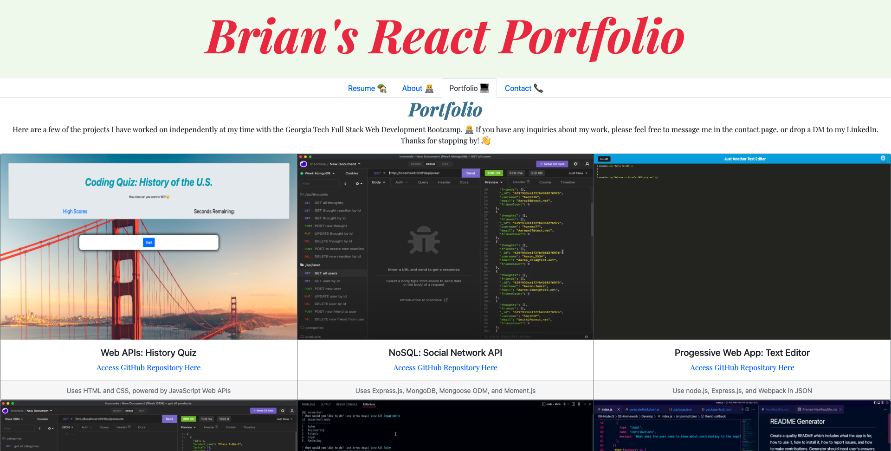

# React Portfolio
This React App is a portfolio page used to display my proficiency with React, Bootstrap, as well as show older projects I have worked on. This README will walk you through how to install this application to your local machine, what the deployed project looks like, the application's usage and how to make contributions.

# Table of Contents  
### [Installation](#installation)
### [Usage](#usage) 
### [License](#license) 
### [Contributions](#contributions) 
### [Questions](#questions) 

# Installation
This web app uses [React.js](https://reactjs.org/) and [Bootstrap](https://getbootstrap.com/).

To install and run, open the code in VS Code. 

Run the terminal and `npm i` to install packages. Type `npm start` to run the app and in open in `localhost:3000`. 

- **[GitHub Deployment](https://itsbrianfire.github.io/react-portfolio-project/)**

# Usage
Upon using this app, your use the navigation tabs to toggle between pages: Resume, About, Portfolio and Contact. Run the react project and navigate the site **[here](https://itsbrianfire.github.io/react-portfolio-project/)**.

# License

### **MIT**

### https://opensource.org/licenses/MIT
The MIT License is a permissive free software license originating at the Massachusetts Institute of Technology (MIT) in the late 1980s. As a permissive license, it puts only very limited restriction on reuse and has, therefore, high license compatibility.

# Contributions
As the developer, I developed the code for the files in this react application in order for this app to function appropriately. This app can be run after proper installation as seen in the instructions above. 

# Questions
Questions or comments about the project? You can reach me at my GitHub *itsbrianfire* — [GitHub Profile](https://www.github.com/itsbrianfire) or contact me at brianhgarcia@gmail.com

Happy Coding!
